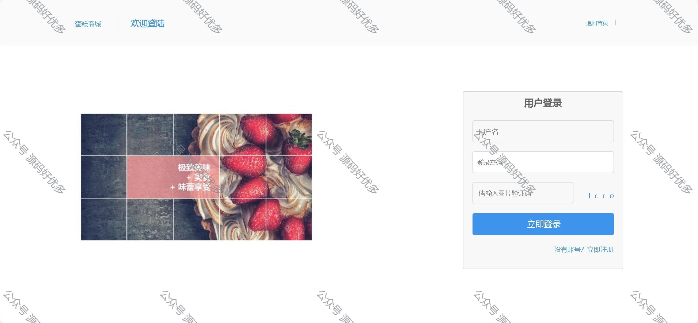

 
## 查看主页获取源码

> **作者介绍**： **✌**全网粉丝10W+本平台特邀作者、博客专家、CSDN新星计划导师、java领域优质创作者,博客之星、掘金/华为云/阿里云/InfoQ等平台优质作者、专注于毕业项目实战 **✌**

  

### 一、作品包含

源码+数据库+全套环境和工具资源+部署教程

### 二、项目技术

前端技术：Html、Css、Js、Layui

数据库：MySQL

后端技术：Java、Spring Boot、MyBatis

  

### 三、运行环境

开发工具：IDEA

数据库：MySQL8.0

数据库管理工具：Navicat10以上版本

环境配置软件： JDK1.8+Maven3.6.3
  

### 四、项目介绍
项目编号：springbootA036

后台功能说明

1. 登录、登出、个人信息、修改密码等基本功能。
2. 首页，数据看板，订单统计、网站基本信息、登录日志等概览数据。
3. 商品管理：含商品列表、新增商品、库存管理、出库信息。
4. 业务管理：在线留言。
5. 售后管理；订单管理、退货管理。
6. 数据统计：销量统计。
7. 系统设置：包含用户管理、资源管理、用户管理、日志管理。
8. 网站设置：首页轮播设置、参数设置、商品分类。

前台功能说明

1. 首页：轮播大图、好物搜索、商品列表速览等。
2. 商品列表页：根据商品分类查看商品列表、可按照价格、上架时间排序。
3. 商品详情页：商品详情信息、添加到购物车、立即购买、收藏、评论查看。
4. 购物车页：购物车列表及相关操作。
5. 提交订单页：订单留言、订单提交。
6. 在线留言。
7. 关于我们。

### 五、运行截图

